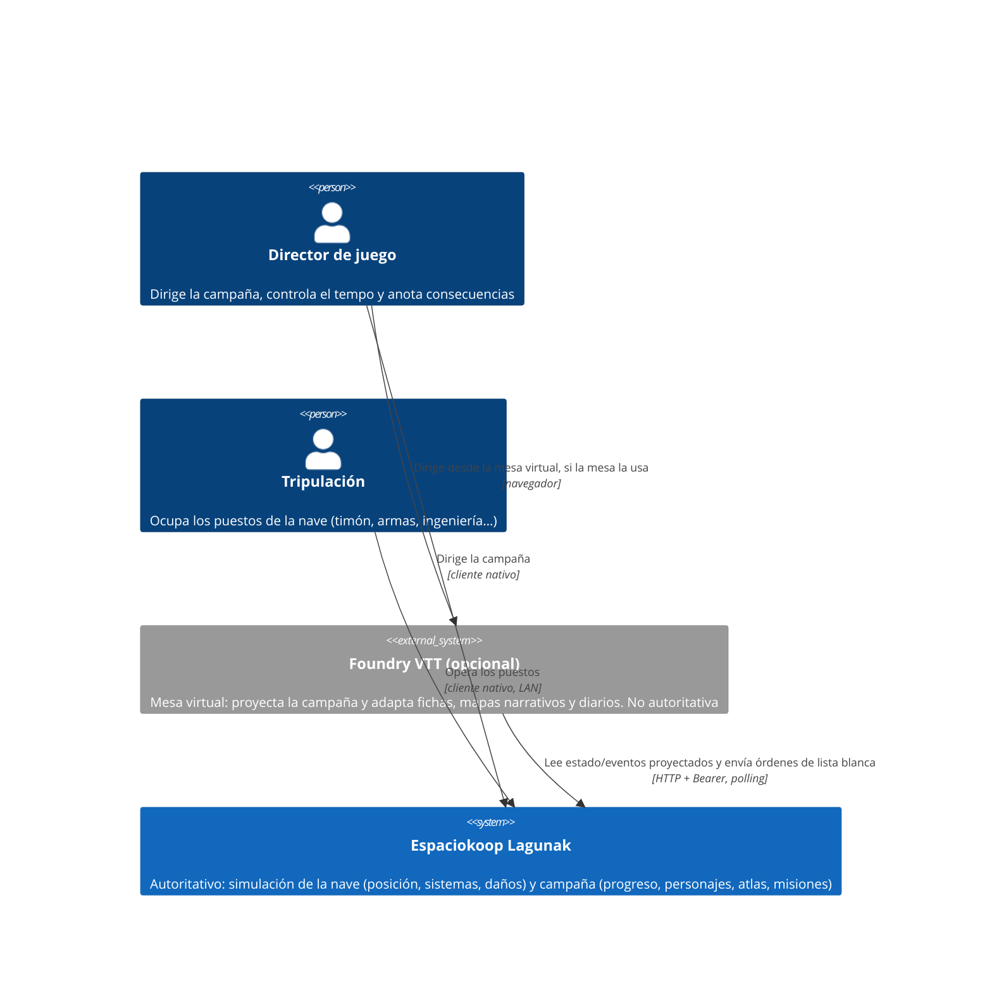
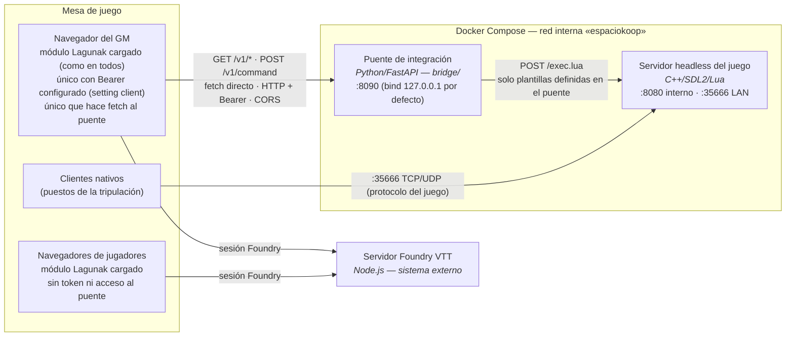
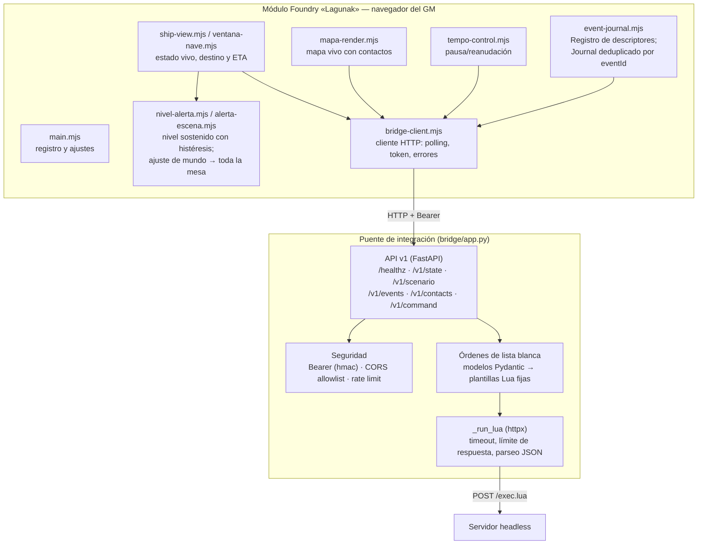
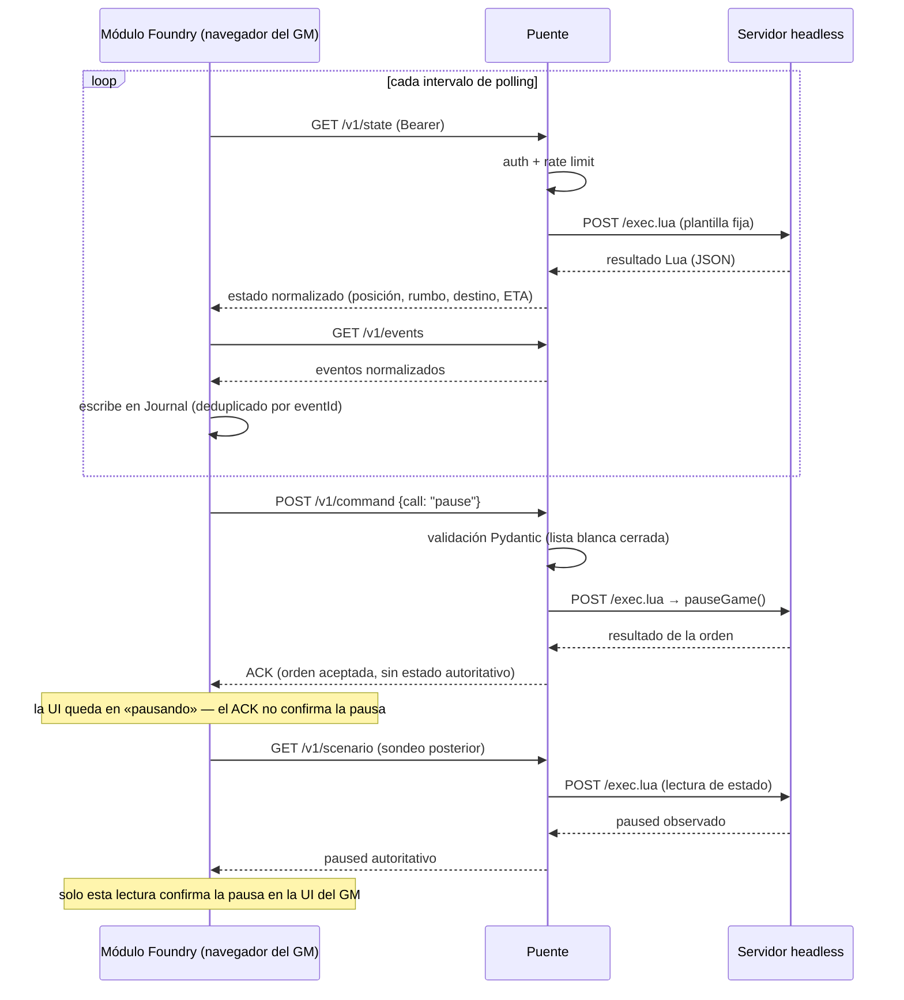

# Arquitectura del sistema — diagramas C4

Este documento explica cómo funciona la aplicación a distintos niveles de
zoom siguiendo el [modelo C4](https://c4model.com/) (estándar de facto para
documentar arquitecturas de software): **contexto → contenedores →
componentes**, más un diagrama de flujo de datos.

Los diagramas existen en dos formatos equivalentes:

- **Fuente editable draw.io**:
  [`docs/assets/diagramas/arquitectura.drawio`](assets/diagramas/arquitectura.drawio)
  (una página por nivel; se abre en [app.diagrams.net](https://app.diagrams.net/)
  o con la extensión *Draw.io Integration* de VS Code). Es la fuente de
  verdad visual: edítala y mantén este documento en sincronía.
- **Mermaid embebido** en este documento, para que GitHub los renderice sin
  herramientas.

Para la autoridad de cada dominio de datos y la visión de juego, ver
[`docs/FOUNDRY.md`](FOUNDRY.md). Para la superficie HTTP exacta,
[`docs/seguridad/API_HTTP.md`](seguridad/API_HTTP.md).

## Nivel 1 — Contexto del sistema

Quién usa el sistema y con qué habla. Espaciokoop Lagunak es autoritativo para
la simulación de la nave **y para la campaña** —progreso, personajes, atlas,
misiones y consecuencias—; Foundry VTT (sistema externo) es una integración
**opcional** que proyecta y adapta, sin poseer nada ([ADR-0008](adr/0008-standalone-first-autoridad-del-nucleo.md),
que sustituye a ADR-0002).

La consecuencia práctica es la pregunta que filtra cualquier propuesta: **¿sigue
siendo jugable si Foundry desaparece?** El GM puede dirigir sin él; con él, gana
una superficie de mesa más cómoda.

## Nivel 2 — Contenedores

Las piezas desplegables y sus límites de red, según el despliegue de
referencia [`docker/compose.yaml`](../docker/README.md). La regla de
seguridad central: **el puerto :8080 del juego (con `/exec.lua`) no se
publica jamás al host**; solo el puente lo alcanza por la red interna.

| Contenedor | Tecnología | Responsabilidad |
|---|---|---|
| Servidor headless | C++ (fork de EmptyEpsilon), escenarios Lua | Simulación autoritativa de la nave y del escenario |
| Puente de integración | Python / FastAPI | Única pieza autorizada a hablar con `/exec.lua`: auth Bearer, CORS estricto, rate limit, órdenes de lista blanca |
| Servidor Foundry | Node.js (sistema externo) | Aloja el mundo y sirve la aplicación web de Foundry a GM y jugadores |
| Módulo Foundry | JavaScript cargado en el navegador de todos los clientes; solo el del GM tiene token y habla con el puente | Presenta el estado vivo, escribe eventos en el Journal y llama directamente al puente; URL y Bearer v0 son settings `client` provisionales |
| Clientes nativos | EmptyEpsilon de escritorio | Puestos de la tripulación por LAN |

## Supuesto de confianza y visibilidad GM

El contrato v0 del puente es una **capacidad GM compartida**, no una frontera de
permisos por jugador. FastAPI solo comprueba la posesión del Bearer: no conoce la
sesión, el usuario ni el rol de Foundry y concede a cualquier poseedor la misma
lista de lecturas y órdenes. El guard `game.user.isGM`, la ausencia de token en
los navegadores de jugadores y CORS reducen exposiciones accidentales en el
cliente, pero no acreditan el rol ante el puente.

En particular, `/v1/contacts` ofrece deliberadamente una vista omnisciente para
el GM, sin aplicar detección, identificación ni ocultación por puesto. El puente
no debe usarse como API directa de tripulación ni sus respuestas GM deben
redistribuirse sin un filtrado autoritativo. Si en el futuro los jugadores hablan
con el puente, esa ampliación requerirá credenciales o capacidades diferenciadas
y endpoints con visibilidad impuesta en el servidor; ocultar controles en la UI
no será suficiente.

El inventario completo de actores, controles y riesgos residuales está en el
[modelo de amenazas del puente](seguridad/BRIDGE_THREAT_MODEL.md).

## Nivel 3 — Componentes

Dentro del puente y del módulo Foundry (los dos contenedores propios de este
fork; el servidor del juego mantiene la arquitectura de EmptyEpsilon).

## Nivel de alerta: lo único que ven todos los clientes

Casi todo el módulo es asimétrico —solo el navegador del GM tiene token y habla
con el puente—, con una excepción deliberada: el **nivel de alerta de la nave**
(verde / amarilla / roja).

- Lo **deriva** `nivel-alerta.mjs` del mismo `/v1/state` que el GM ya sondea.
  Es lógica pura, con **histéresis**: se entra en un nivel con un umbral y solo
  se sale con otro más holgado, para que una nave oscilando en el borde no haga
  parpadear la pantalla en cada sondeo.
- Lo **publica** el GM en un ajuste de mundo, y solo cuando cambia.
- Lo **lee** cualquier cliente y lo aplica como un borde de aviso sobre el
  viewport. Al ser un ajuste de mundo, un jugador que se conecta tarde ve la
  alerta vigente sin esperar al siguiente sondeo.

No es una fuga de información oculta: una tripulación sabe perfectamente que su
propia nave está en alerta roja. Tampoco toca ningún documento de escena — es
una capa de presentación, así que volver a verde no deja nada que limpiar.
Se distingue de `alertas-nave.mjs`, que detecta **flancos** (el instante del
cruce) y los anota una vez en la bitácora; esto describe el estado **mientras
dura**.

## Flujo de datos — polling y una orden

El transporte del contrato v0 está fijado en **polling HTTP** (issue #6). El
módulo nunca envía Lua: los fragmentos viven en el puente y las entradas del
cliente solo rellenan valores tipados y validados.

## Mantenimiento

- Si cambia la topología (nuevos contenedores, puertos, transporte), actualiza
  **primero** el `.drawio` y después los Mermaid de este documento.
- Los nombres de componentes deben coincidir con los ficheros reales
  (`bridge/app.py`, `foundry-module/scripts/*.mjs`); si renombras código,
  renombra aquí.
