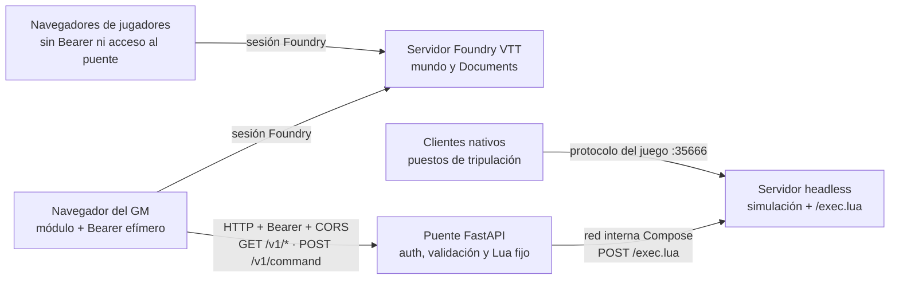

# Modelo de amenazas del puente Foundry

## Propósito y alcance

Este documento describe la frontera de seguridad entre el módulo Foundry VTT,
el puente HTTP y el servidor headless de Espaciokoop Lagunak. Es una referencia
para diseño y revisión; no sustituye una auditoría ni convierte el despliegue en
un servicio apto para Internet.

El activo de mayor riesgo es el endpoint heredado `/exec.lua`: ejecuta Lua
arbitrario sin autenticación. La decisión vinculante es
[ADR-0001](../adr/0001-exec-lua-nunca-expuesto.md): el puerto 8080 permanece en la
red interna de Compose y el puente es su único cliente.

## Flujo de datos y fronteras

1. **Navegador del GM ↔ puente.** `fetch` sale del navegador, no del proceso
   servidor de Foundry. El Bearer acredita posesión de la credencial, no una
   identidad ni un rol de Foundry. CORS limita qué orígenes web pueden leer la
   API, pero no autoriza clientes no navegador.
2. **Puente ↔ servidor headless.** Es la frontera crítica. El puente envía a
   `/exec.lua` únicamente fragmentos definidos en `bridge/app.py`; nunca reenvía
   Lua recibido por red. El puerto heredado no se publica al host.
3. **Navegador ↔ servidor Foundry.** Foundry autentica usuarios y gobierna
   Documents, permisos y Journal. El puente no participa en esa autorización.
4. **Clientes nativos ↔ juego.** El protocolo de puestos no atraviesa el puente
   y queda fuera de este modelo salvo cuando una acción del puente modifica el
   mismo estado autoritativo de la nave.

Fuentes de arquitectura: [`ARQUITECTURA.md`](../ARQUITECTURA.md),
[`FOUNDRY.md`](../FOUNDRY.md) y
[`docker/compose.yaml`](../../docker/compose.yaml).

## Activos

- **Capacidad de ejecutar Lua en el juego.** Una exposición o passthrough de
  `/exec.lua` equivaldría a ejecución remota de código dentro del proceso.
- **Bearer del puente.** Su posesión permite todas las lecturas y órdenes que el
  contrato v0 autoriza.
- **Estado autoritativo de la simulación.** Posición, sistemas, daños, tempo y
  encuentros no deben aceptar valores fuera de los contratos cerrados.
- **Información de campaña y telemetría GM.** Contactos, facciones, eventos y
  Journal pueden contener información que los jugadores todavía no conocen.
- **Disponibilidad de la mesa.** El sondeo, las órdenes y la traducción Lua no
  deben agotar el puente ni bloquear el servidor de juego.
- **Integridad del Journal.** Eventos repetidos o falsificados no deben crear
  consecuencias narrativas duplicadas.

## Actores y confianza

### Confiables dentro del modelo

- La persona operadora que configura Compose, el origen permitido y el Bearer.
- El código revisado y las imágenes verificadas del puente y del módulo.
- El GM que recibe el Bearer para esa sesión.

Esta confianza no convierte el navegador en un almacén seguro: extensiones,
XSS, herramientas de desarrollo o un equipo comprometido pueden extraer una
credencial presente en memoria.

### No confiables o parcialmente confiables

- Navegadores de jugadores y cualquier cliente sin Bearer.
- Clientes HTTP externos, aunque conozcan una URL del puente.
- La red entre navegador y puente cuando no está protegida por loopback, túnel,
  VPN confiable o TLS.
- Todo cuerpo, cabecera, valor y frecuencia de petición recibidos por la API.
- Respuestas del servidor heredado: se consideran datos que deben tener timeout,
  tamaño acotado y JSON válido, no contenido fiable por defecto.
- Datos de telemetría mostrados en Foundry: deben tratarse como texto externo y
  no como HTML ejecutable.

## Supuestos de autenticación y autorización

- `/healthz` es público y solo informa de salud general. `/v1/*` exige el mismo
  Bearer compartido.
- El token es la autoridad efectiva del puente. `game.user.isGM` protege la UI y
  reduce errores accidentales, pero **no acredita el rol ante FastAPI**.
- El módulo conserva el token en memoria de la pestaña del GM y lo pierde al
  recargar o cerrar. Esto reduce persistencia, pero no protege un navegador ya
  comprometido.
- CORS no sustituye al Bearer y no detiene `curl`, malware ni otro cliente HTTP.
- El bind seguro por defecto es loopback. Cualquier acceso desde otro host exige
  un transporte confiable; publicar el puente directamente en Internet no está
  soportado.
- El contrato v0 no diferencia capacidades de lectura y escritura ni identidades
  por usuario. Toda persona que obtenga el Bearer dispone de la allowlist
  completa.

## Amenazas, controles y huecos conocidos

| Amenaza | Control actual | Riesgo residual / seguimiento |
|---|---|---|
| Acceso sin autorización o suplantación del GM | Bearer obligatorio, comparación en tiempo constante y UI solo-GM | Un Bearer robado concede la allowlist completa; seguir la [rotación y revocación operativas](BRIDGE_AUTHENTICATION.md) |
| Ejecución de Lua arbitrario | Puerto 8080 interno, guardia CI, modelos Pydantic y plantillas Lua del servidor | Un cambio malicioso o defectuoso en `bridge/app.py` sigue siendo código privilegiado y requiere review adversarial |
| Alteración con campos u operaciones fuera de contrato | Unión discriminada, enums y rangos cerrados; algunas órdenes prohíben campos extra; todos los cuerpos mutables se limitan a 16 KiB antes del parseo JSON | El límite de tamaño no sustituye la validación semántica ni una cuota diferenciada por identidad |
| Lectura de telemetría reservada al GM | Bearer solo entregado al GM; jugadores sin URL/token ni `fetch` al puente | `/v1/contacts` es deliberadamente omnisciente y el puente no aplica visibilidad por jugador; seguimiento documental #250 |
| Intercepción del Bearer o respuestas | Loopback por defecto; se exige túnel, VPN confiable o HTTPS fuera del host | HTTP en una red no confiable revela credencial y estado; no hay TLS integrado en FastAPI |
| Repetición de una orden | Lista blanca y validación reducen el impacto de cada llamada | El contrato v0 no tiene nonce ni idempotency key general: un retry puede repetir una mutación |
| Duplicación de eventos en Journal | `eventId` persistido y comprobado antes de crear la página | Depende de que cada productor emita una identidad de sesión/evento estable |
| Agotamiento del puente o del juego | Rate limit global, cuerpos entrantes limitados a 16 KiB, timeout de 5 s y respuesta heredada limitada a 64 KiB | El rate limit es global, en memoria y por proceso; no sustituye límites del proxy ni cuotas por cliente |
| Respuesta heredada malformada o excesiva | Estado HTTP, tamaño y parseo JSON se validan; errores se traducen a `502` genérico | Un servidor de juego comprometido puede degradar disponibilidad; no se considera una raíz de confianza para secretos |
| Filtración por errores o logs | Errores externos genéricos; política de no registrar tokens | Dependencias, proxy y configuración operativa deben conservar la misma redacción |

## Fuera de alcance

- Endurecer Foundry VTT, el sistema de juego, el navegador, extensiones o el
  equipo del GM frente a compromiso local.
- Autorizar jugadores por puesto en el bridge v0; hoy los jugadores operan sus
  estaciones nativas y no reciben el Bearer.
- Auditar o rediseñar el protocolo nativo TCP/UDP del juego en el puerto 35666.
- Aislamiento frente a escape de contenedor, kernel o una persona operadora con
  control del host.
- Convertir el bridge en servicio público de Internet o en frontera multi-tenant.
- Corregir vulnerabilidades heredadas de EmptyEpsilon que no atraviesen esta
  integración; deben notificarse también a upstream cuando proceda.

## Invariantes de revisión

Una contribución requiere revisión de seguridad específica si:

- publica o cambia la red del puerto 8080, usa `network_mode: host` o añade otra
  ruta hacia `/exec.lua`;
- incorpora una operación, enum, campo o plantilla Lua nueva;
- mueve el Bearer a almacenamiento persistente, logs, Journal, sockets o ajustes
  de mundo;
- permite `fetch` al bridge desde jugadores o comparte telemetría GM;
- cambia CORS, rate limit, timeouts, límites de tamaño o tratamiento de errores;
- añade reintentos de órdenes mutables sin idempotencia;
- modifica la autoridad de datos definida en
  [ADR-0002](../adr/0002-autoridad-de-datos-foundry-vs-simulacion.md).

Ante cualquiera de esos cambios deben actualizarse este modelo, las pruebas
adversariales aplicables y la documentación de despliegue. Una prueba verde no
anula una frontera arquitectónica incumplida.
