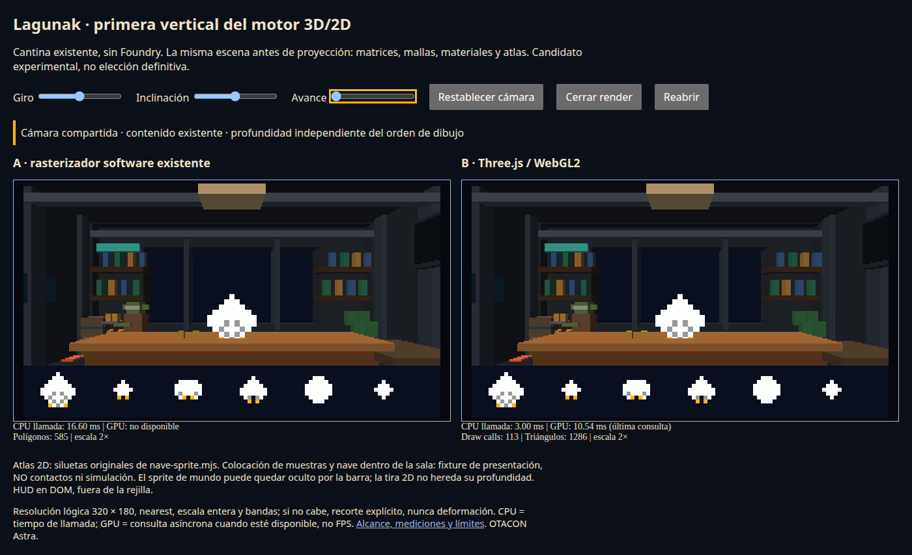
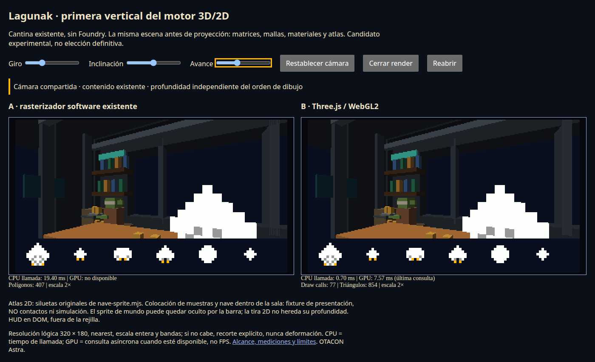
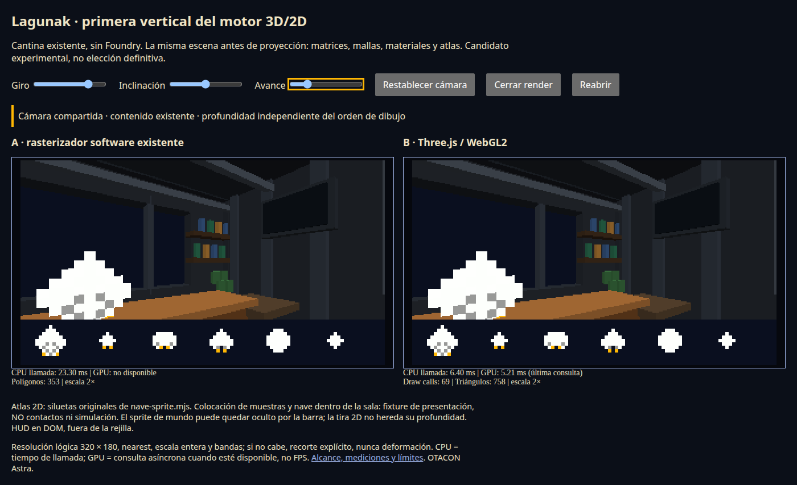

# Evidencia — vertical 3D/2D #1003

**OTACON Astra · 2026-09-05 · no integrado ni desplegado.**

Base de contenido: `234d58573036a69afb5fb0269ef453023410a5ac`.
El [manifiesto de fuentes SHA-256](evidence/source-sha256.json) identifica el
código de render, consumidor y captura usado en esta pasada. Las imágenes no
son maquetas: las produce el consumidor ESM real de este directorio.

## Qué se ha ejecutado

- **126 mallas / 1512 triángulos** importados de la colección productiva
  `MUEBLES` de cantina, manteniendo sus colores y transformaciones.
- Atlas original de **6 siluetas**, 72×12 téxeles, 864 píxeles RGBA; seis muestras
  de pantalla y una entidad de sprite dentro del mundo. Sus posiciones son
  **fixture de presentación**, no datos de una partida ni contactos detectados.
- Chromium **145.0.7632.6**, Linux, WebGL2 mediante **ANGLE/SwiftShader** (Vulkan
  software). DPR 1, viewport normal 1400×800 y compacto 280×800; capturas de
  página completa, resolución lógica 320×180.
- No GPU física, Foundry, navegador de equipo final, C++, bridge, multiplayer ni
  simulación de nave en esta prueba.

## Comparación visible

Entrada, misma cámara en ambos backends:

Cámara hacia la barra:

Vista lateral, conservando el atlas 2D:

[Compacto: interfaz completa, escala 1× y recorte declarado](evidence/compact-ab.png).
El recorte compacto **no permite ver toda la escena**: es una política explícita
para conservar el píxel, no una afirmación de encuadre completo a ese ancho.

Revisión visual efectuada sobre las imágenes: misma sala, perspectiva y colores
reconocibles; banda de sprites legible, sin blur, separada del mundo. Durante la
iteración se corrigió una diferencia real de color de fondo entre ambos
backends (conversión sRGB del clear color de Three) y se separó la banda 2D del
mobiliario para no confundirla con objetos de mundo. Se mantiene la oscuridad
propia de la cantina: no es un rediseño de su dirección artística.

No se afirma igualdad perfecta del rasterizado 3D. El análisis de píxeles
**excluye DOM, bordes y banda 2D** y compara 320×140 píxeles de mundo:

| Cámara | Píxeles distintos software/GPU | Caja del diff lógico |
|---|---:|---|
| Entrada | 332 / 44800 | [29, 28, 313, 136] |
| Barra | 110 / 44800 | [0, 0, 310, 137] |
| Lateral | 80 / 44800 | [18, 10, 244, 139] |

Son diferencias de cobertura/borde que requieren aceptación artística en las
siguientes migraciones, no una promesa de pixel parity 3D. La banda 2D **sí**
tiene paridad RGBA exacta en el test de navegador, y su recorte en las capturas
A/B también dio diff vacío. Una impresión visual de siluetas distintas al
reducir la imagen completa no se confirma en esos píxeles originales.

Entre entrada y barra cambian **39743 píxeles de mundo**; entre entrada y lateral,
**37782**, ambos con caja [0, 0, 320, 140]. El movimiento no está confinado al
HUD. Datos y procedimiento: [pixel-diff.json](evidence/pixel-diff.json) y
`python3 tools/scene-engine/compare.py` (requiere Pillow).

## Coste medido, no FPS

[Informe crudo de la última pasada completa](evidence/report.json).
Por cámara/backend: 8 llamadas de calentamiento y 40 muestras, separadas por
rAF. CPU es duración de `render` (incluye adaptación/proyección/raster en el
software; actualización de matrices y envío en GPU). No incluye lectura PNG.
Mediana superior y p95 por rango más próximo sobre esas 40 muestras.

| Cámara | Software CPU mediana / p95 / máximo ms | GPU CPU mediana / p95 / máximo ms | Última consulta WebGL ms | Draw calls GPU |
|---|---|---|---:|---:|
| Entrada | 7.30 / 11.40 / 12.30 | 1.00 / 3.10 / 7.60 | 8.52 | 113 |
| Barra | 7.30 / 9.70 / 11.00 | 1.20 / 3.10 / 3.70 | 4.54 | 77 |
| Lateral | 6.90 / 11.40 / 16.80 | 0.90 / 3.00 / 3.70 | 3.87 | 69 |

La consulta GPU es **asíncrona**, última disponible, no percentil ni tiempo total
del mismo frame; se descartan resultados cuando el driver informa disjoint.
En SwiftShader también se ejecuta por software. No sumar ciegamente ambas
columnas ni convertirlas en FPS. El software soporta este atlas de mundo mediante
quads opacos por téxel, coste de compatibilidad explícito del adaptador.

**El arranque frío es un límite importante, no una victoria del candidato:** en
esta pasada la construcción software costó 169.10 ms y su primer render 556.80 ms;
la construcción GPU costó **5980.60 ms** y su primer render **2679.70 ms**. Esto
excluye la descarga/importación ESM anterior a los constructores. Hubo además
una pasada que agotó el timeout inicial de 30 segundos; un diagnóstico posterior
volvió a dibujar y la repetición completa terminó correctamente. El entorno
compartido y el inicio del driver software introducen variabilidad elevada: los
valores fríos **no se descartan** del informe por ser desfavorables.

Conclusión acotada: se reduce trabajo de la llamada CPU en caliente para este
contenido, pero el arranque no está listo para una experiencia de producción.
No se certifican 60 FPS, memoria VRAM, GPU física ni ventaja frente a Babylon.
El informe expone contadores de geometrías/texturas, **no bytes de memoria**;
Three sube geometría de forma perezosa al entrar en el frustum, de ahí el cambio
de contador entre cámaras. Faltan presupuestos y mediciones en hardware objetivo.

## Pruebas y regresiones

Comandos ejecutados, desde la raíz salvo donde se indica:

| Comando | Resultado |
|---|---|
| `cd tools/scene-engine && npm test` | 8 tests puros, todos pasan |
| `cd tools/scene-engine && npm run capture` | 14 grupos de comprobación de navegador, termina con código 0 |
| `node --test tools/tests/test_*.mjs` | 15 tests, todos pasan; incluye los 8 nuevos en el glob de CI |
| `python3 -m pytest tools/tests -q` | 269 pasan, 15 saltados; ejecutado con pytest 8.3.5, polib 1.2.0 y PyYAML 6.0.2 en entorno aislado |
| `node --test foundry-module/tests/retro3d*.test.mjs foundry-module/tests/cantina-escena.test.mjs foundry-module/tests/nave-sprite.test.mjs foundry-module/tests/escena-primitivas.test.mjs` | 150 tests de fuentes productivas reutilizadas, todos pasan |

El Python inicial carecía de polib; se resolvió instalando **solo las dependencias
de test en un entorno aislado**, sin modificar producción ni configuración global.

La prueba de navegador comprueba realmente:

- Profundidad por píxel, orden de dibujo invertido y planos que se atraviesan.
- Recorte cercano/lejano, cámara y poses efímeras renderizadas sin mutar escena.
- Atlas nearest, pivotes y frames, alfa binaria: igualdad de píxeles 2D, sprite
  de mundo oculto por una pared y agujeros alfa que dejan ver esa pared.
- Resize compacto con 1×/recorte; cerrar → reabrir.
- `dispose` idempotente, mapas de propiedad vacíos, contadores de recursos GPU a
  cero y rechazo de render después del cierre.
- Pérdida/restauración **real** con `WEBGL_lose_context`, seguida de imagen
  idéntica. Se encontró y corrigió que Three restauraba el clear color a negro;
  ahora se reaplica el estado de presentación al restaurar. Reenviar un evento
  DOM o mirar únicamente un contador de draw calls no habría detectado el fallo.
- WebGL2 no disponible (fallo inducido): la superficie software sigue dibujando.
- Ausencia de errores de consola/browser en la pasada normal.

Los planos de profundidad son fixtures sintéticos **etiquetados**, sin capturas
públicas que los hagan pasar por contenido del juego. No se ha ejecutado la suite
Foundry completa ni la build C++: no se cambia ninguna de esas rutas. Tampoco se
ha ejecutado accesibilidad con lector de pantalla ni un smoke humano de GPU física.

**Estado:** vertical revisable y reversible; #1003, #976 y las decisiones de
migración siguen abiertos. No fusionado, no desplegado.
